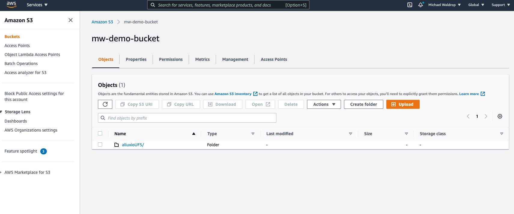
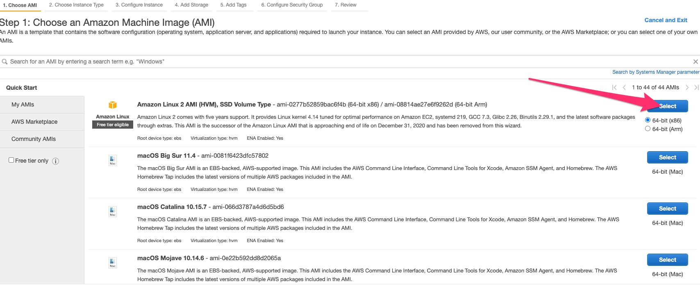
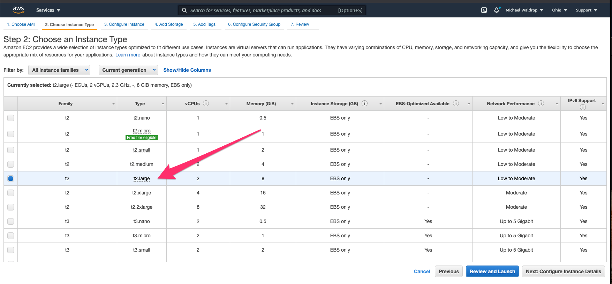
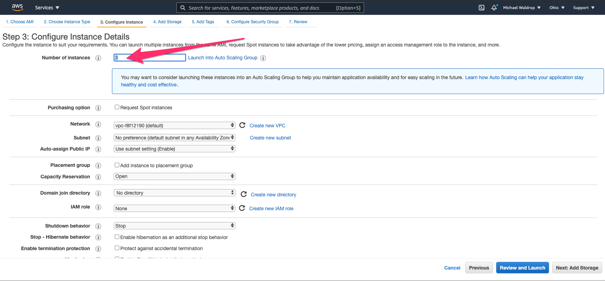
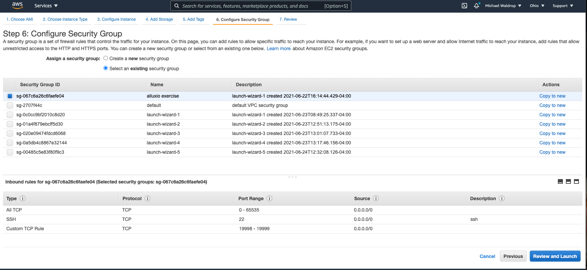
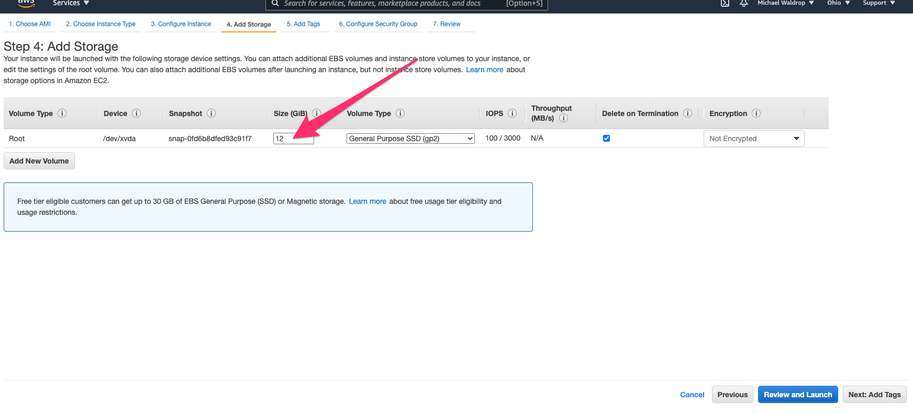

# simple-alluxio-cluster
This project provides a very simple deployment script to create a 3 node cluster to AWS with Alluxio installed and configured.  This is NOT an implementation of best practices for any production workload.  Many simplifications are made and assumed to keep this simple.

The end result of using this script will be a singe master node and 2 worker nodes configured to run Alluxio against an S3 understore.

The launchCluster.sh script needs a few things to be in place in order to function:
1) Make sure you have an AWS access key file that allows you to create and connect to EC2 instances.
2) Create a security group with a few very simple rules:

3)Make sure you have your AWSAccessKeyId and AWSSecretKey values.  For the most simple case, you can create your own 'root access' credentials under the "Access Keys" section of your security credentials in the AWS console.
4) Create an S3 bucket and a folder within that bucket.  This is what Alluxio will use as an understore:

5) Now we will launch 3 EC2 nodes.  Simply launch 3 instances of t2.large, use your access key, update the storage to 12GB, select your security group, and launch the instances.









6) Download a copy of Alluxio Community edition and place it in your S3 bucket and make it public.  The script will wget the code from this URL on each node.  If you have a different URL that the script can access to get the bits, that will work also

Now you are ready to modify the launchCluster.sh script so you can configure and deploy the Alluxio software to your instances.  At the top of the file are a few values to modify:  
```
MASTER="<MASTER-NODE-NAME>"
WORKER1="<WORKER1-NODE-NAME>"
WORKER2="<WORKER2-NODE-NAME>"
BITS="<URL-FOR-ALLUXIO-BITS>"
S3_BUCKET="<S3-BUCKET_URL>"
AWS_CERT_FILE="<LOCAL-CERT-FILE>"
ACCESS_KEY="<AWS-ACCESS-KEY>"
AWS_SECRET="<AWS-SECRET>"
```

Pay close attention to these values to make sure the script runs successfully.

Now you can run the launchCluster.sh script.  Make sure your AWS key file (.pem or .cer file), and all the files in this rep are in the same directory where you execute the script.  You can monitor the output of the script and should see that all the parts execute successfully.

When the script completes, you should be able to ssh into the master node and start Alluxio and run all the sample tests.
