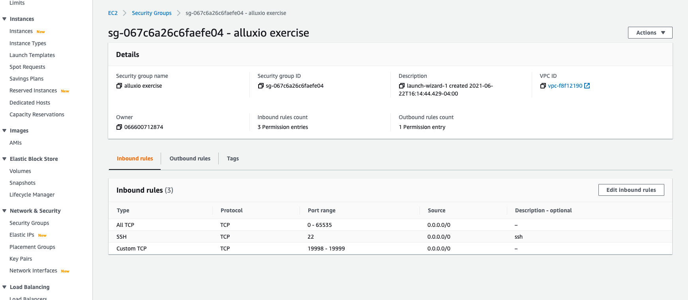

# simple-alluxio-cluster
This project provides a very simple deployment script to create a 3 node cluster to AWS with Alluxio installed and configured.

The end result of using this script will be a singe master node and 2 worker nodes configured to run Alluxio against an S3 understore.

The launchCluster.sh script needs a few things to be in place in order to function:
1) Make sure you have an AWS access key file that allows you to create and connect to EC2 instances.
2) Create a security group with a few very simple rules:

3)
